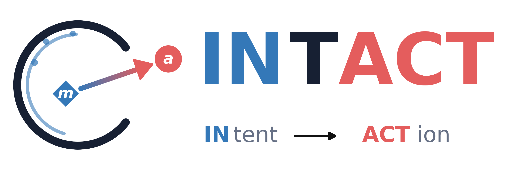
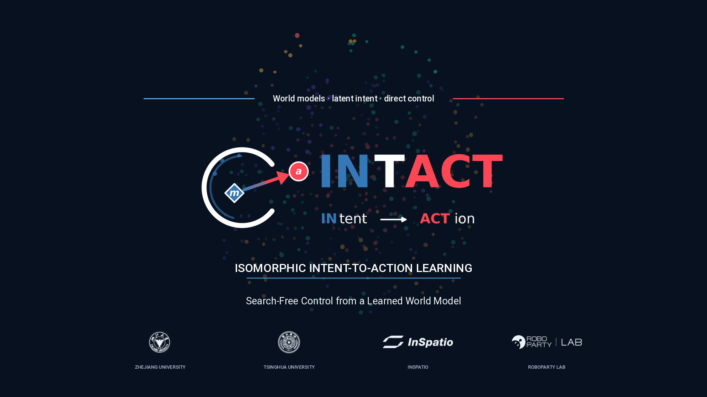
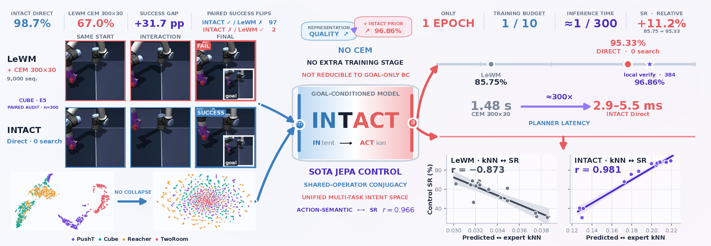
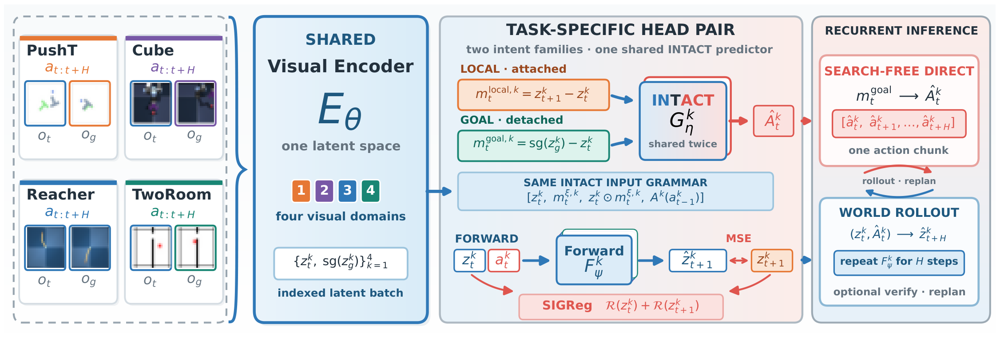
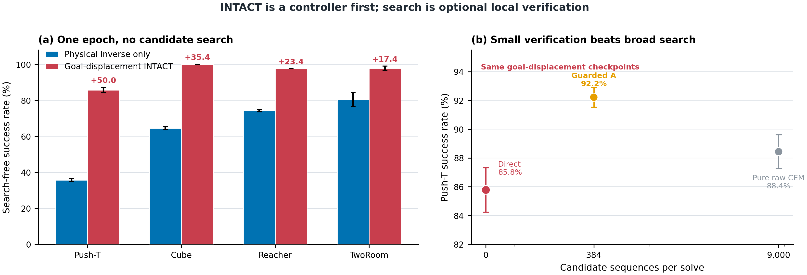
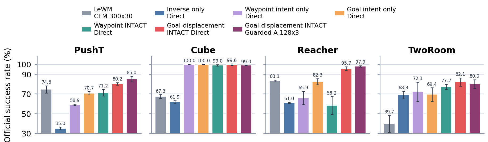
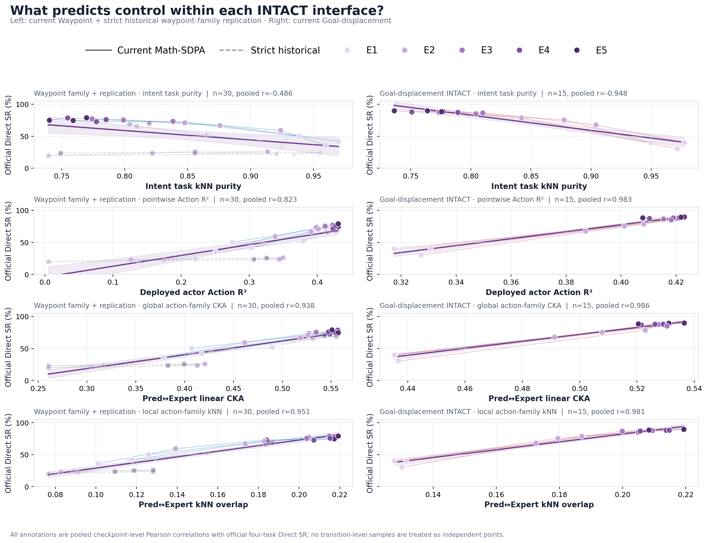

<div align="center">
  

  <h1>INTACT: Isomorphic Intent-to-Action Learning for Search-Free World Models</h1>

  <p><strong>Train a world model to answer the control query it will receive at deployment.</strong></p>
  <p>End-to-end JEPA world modeling for goal-conditioned robot control without broad action search.</p>

  <p>
    <a href="https://github.com/DavidSunok">Junhan Sun</a><sup>1,4</sup>
    &nbsp;&middot;&nbsp; Hao Zhao<sup>2,4,&dagger;</sup>
    &nbsp;&middot;&nbsp; Guofeng Zhang<sup>1,3,&dagger;</sup>
  </p>
  <p>
    <sup>1</sup>State Key Laboratory of CAD&amp;CG, Zhejiang University<br>
    <sup>2</sup>Institute for AI Industry Research (AIR), Tsinghua University<br>
    <sup>3</sup>InSpatio &nbsp;&middot;&nbsp; <sup>4</sup>RoboParty Lab<br>
    <sup>&dagger;</sup>Corresponding authors
  </p>

  <p>
    <a href="https://arxiv.org/abs/2607.26056"></a>
    <a href="https://zju3dv.github.io/INTACT-JEPA/"></a>
    <a href="#implementation-and-reproduction"></a>
    <a href="https://huggingface.co/INTACT-JEPA/INTACT"></a>
  </p>
  <p>
    <a href="https://zju3dv.github.io/INTACT-JEPA/community/"></a>
  </p>
  <p>
    <a href="#why-intact">Why INTACT?</a> &nbsp;&middot;&nbsp;
    <a href="#installation">Installation</a> &nbsp;&middot;&nbsp;
    <a href="#training">Training</a> &nbsp;&middot;&nbsp;
    <a href="#evaluation">Evaluation</a> &nbsp;&middot;&nbsp;
    <a href="docs/METHOD.md">Method Notes</a> &nbsp;&middot;&nbsp;
    <a href="#results">Results</a> &nbsp;&middot;&nbsp;
    <a href="README_CN.md">中文</a>
  </p>
</div>

## Project Film

<p align="center">
  <a href="https://zju3dv.github.io/INTACT-JEPA/#project-film">
    
  </a>
</p>
<p align="center">
  <a href="https://zju3dv.github.io/INTACT-JEPA/#project-film">Open the interactive project page</a>
</p>

<p align="center">
  
</p>

<p align="center">
  <a href="https://zju3dv.github.io/INTACT-JEPA/community/">
    
  </a>
</p>

## Why INTACT?

We introduce **INTACT** (**IN**tent-To-**ACT**ion), an end-to-end JEPA that
turns action-labeled, reward-free trajectories into a deployable
intent-to-action interface. The name captures both the structure we impose and
the information we preserve:

- **Isomorphic between predictor graphs.** Local and goal motion-intent calls
  use the same four-slot input grammar and the same parameters.
- **Isomorphic between supported families.** Local and goal intent families
  correspond through the action-law semantics induced by that shared
  predictor, not through pointwise latent equality.
- **Intact from RGB evidence to latent intent.** End-to-end action gradients
  retain action-effective visual information while suppressing nuisance that
  is unrelated to motion intent.
- **Intact from intent families to action-law families.** The shared predictor
  preserves the supported family correspondence all the way to direct action
  readout.

## TL;DR

Forward world models answer **"what will happen if I execute this action?"**
Yet deployment asks the inverse question: **"which action realizes this
intent?"** CEM and MPPI answer it by numerically searching over many candidates,
leaving training and inference without a learned semantic correspondence. The
result is often a *predictor plus an action searcher*, rather than a
self-consistent intent-action model.

**INTACT learns that missing correspondence end to end.** One conditional
operator maps both observed physical change and deployable goal intent to an
action law. Its conditional mean is a zero-search controller; sampling is
retained only for diversity or optional local verification. No frozen encoder,
extra policy-training stage, or globally linear latent dynamics is required.

<p align="center">
  <strong>1 epoch</strong> training &nbsp;&middot;&nbsp;
  <strong>95.33%</strong> Direct macro &nbsp;&middot;&nbsp;
  <strong>0</strong> search &nbsp;&middot;&nbsp;
  <strong>2.9-5.5 ms</strong> latency
</p>
<p align="center">
  <strong>89.39%</strong> Shared E5 Direct &nbsp;&middot;&nbsp;
  <strong>96.86%</strong> Guarded &nbsp;&middot;&nbsp;
  <strong>23.44x</strong> fewer candidates
</p>

## Paper, Website, and Code

This repository is a **public research release**. The method record, audited
result tables, attribution, reproducibility contract, training code, and
evaluation code are organized here. Model assets are distributed separately
through the public
[INTACT Hugging Face repository](https://huggingface.co/INTACT-JEPA/INTACT).

| Artifact | Status |
|---|---|
| Method and result documentation | Available in this repository |
| Reproducibility contract | Available in [`docs/REPRODUCIBILITY.md`](docs/REPRODUCIBILITY.md) |
| Training and evaluation code | Available in this repository |
| Configurations and checkpoint manifests | Available in `config/` and `checkpoints/` |
| Model checkpoints | [Available on Hugging Face](https://huggingface.co/INTACT-JEPA/INTACT) |
| Paper | arXiv preprint [2607.26056](https://arxiv.org/abs/2607.26056) (2026-07-28) |
| Project website | [zju3dv.github.io/INTACT-JEPA](https://zju3dv.github.io/INTACT-JEPA/) |

The current artifact status is tracked in [Release Status](docs/RELEASE.md).

## Implementation and Reproduction

The released implementation includes task-specific training, four-task
shared-encoder training, Direct/Pure-CEM/Actor-CEM/Guarded-A inference,
Official LeWM and CLEAR-LeWM v0.5.1 evaluation entrypoints, checkpoint
manifests, and an isolated compatibility runtime for the published paper
checkpoints.

### Installation

The CUDA environment was validated on Ubuntu 22.04, Python 3.10,
PyTorch 2.6.0, and CUDA 12.4:

```bash
git clone https://github.com/zju3dv/INTACT-JEPA.git
cd INTACT-JEPA
bash scripts/install.sh cu124
source .venv/bin/activate
cp .env.example .env
# Edit .env so STABLEWM_HOME and LOCAL_DATASET_DIR point to the cache root.
python scripts/preflight_check.py train-single \
  --task pusht --train-seed 3072
```

Use `bash scripts/install.sh cpu` only for import and configuration checks on
a machine without an NVIDIA GPU. Full training and evaluation require CUDA.
See [Installation](docs/INSTALL.md) for system packages, manual setup, data
conversion, and first-run diagnostics.

### Data

INTACT uses the official datasets in the
[LeWM Hugging Face collection](https://huggingface.co/collections/quentinll/lewm).
Existing data are reused in place and are never downloaded implicitly by the
training scripts. Configure this layout through `.env`:

```text
$LOCAL_DATASET_DIR/
└── datasets/
    ├── pusht_expert_train.lance
    ├── ogbench/cube_single_expert.h5
    ├── reacher.h5
    └── tworoom.h5
```

All four published sources yield HDF5 files after download and extraction.
The canonical training configuration converts only PushT to Lance for compact,
batched random clip access; evaluation continues to use the original HDF5 file.
After placing `pusht_expert_train.h5` in `datasets/`, convert it once with:

```bash
python -m stable_worldmodel.cli convert \
  pusht_expert_train pusht_expert_train.lance \
  --source-format hdf5 --dest-format lance
```

### Preflight checks

```bash
# Validate one-task training before launch.
python scripts/preflight_check.py train-single \
  --task pusht --train-seed 3072

# Validate four-task shared-encoder training.
CUDA_VISIBLE_DEVICES=0,1,2,3 \
python scripts/preflight_check.py train-multitask --train-seed 3072
```

The launchers run the matching preflight automatically. Set
`INTACT_SKIP_PREFLIGHT=1` only after running it separately.

### Training

Training always uses Math SDPA.

#### **Single-Task Training**

The task-specific paper setting trains one model per task for one full-data
epoch:

```bash
CUDA_VISIBLE_DEVICES=0 bash scripts/train_single.sh \
  pusht 3072 displacement
```

Replace `pusht` with `cube`, `reacher`, or `tworoom`. Replace `displacement`
with `waypoint` for the matched coordinate-intent control.

Each effective eight-frame window trains all seven physical and all seven goal
transitions, both starting at index 0. An interior clip uses its true preceding
action chunk. At an episode boundary, only unavailable primitive history is
filled with raw neutral commands before applying the action z-score. Evaluation
uses the same reset convention. See
[Previous-Action Boundary Correction](docs/PREVIOUS_ACTION_BOUNDARY_20260804.md)
for the exact contract and compatibility warning.

#### **Joint Multi-Task Training**

The four-task E5 setting uses the same 7/7 objective in four processes, one task
per GPU, with one shared encoder/projector and task-specific Forward/action
heads:

```bash
CUDA_VISIBLE_DEVICES=0,1,2,3 bash scripts/train_multitask.sh \
  3072 displacement "$STABLEWM_HOME/checkpoints" \
  outputs/intact_multitask_goal_s3072_e5
```

Its released default is fused AdamW, constant `lr=5e-4`, weight decay `1e-3`,
SIGReg `0.03`, five epochs, Math SDPA, and batch 256 per task. Do not silently
reduce the batch when reporting a paper-protocol reproduction.

Both launchers print all artifact paths and emit machine-readable progress at
step 1, every 100 steps, and the final step:

```text
TRAIN_PROGRESS={"epoch": 1, "global_step": 100, "loss": ..., "lr": ..., "eta_seconds": ...}
MULTITASK_PROGRESS={"task": "pusht", "rank": 0, "global_step": 100, ...}
```

### Evaluation

The evaluation modes are separate solver interfaces, not hidden ablation
flags:

| Mode | Actor | Search | Role |
|---|---|---|---|
| `direct` | yes | none | Native search-free controller |
| `pure_cem` | no | CEM | Actor-disabled representation/control baseline |
| `actor_cem` | initialization | CEM | Actor-centered optional verification |
| `guarded_a` | yes (Direct reference) | local CEM (128x3) | Direct-centered guarded verification |

Official LeWM and CLEAR-LeWM v0.5.1 are both supported evaluation protocols.
Their results are reported separately because their reset distributions and
success criteria differ.

#### **Official LeWM**

```bash
bash scripts/eval_official.sh direct pusht \
  intact_goal_pusht_s3072_e1/weights_epoch_1.pt 42 100
bash scripts/eval_official.sh pure_cem pusht \
  intact_goal_pusht_s3072_e1/weights_epoch_1.pt 42 100
```

#### **CLEAR-LeWM v0.5.1**

Install [CLEAR-LeWM](https://github.com/DavidSunok/CLEAR-LeWM) using its v0.5.1
setup guide, then point the adapter to that environment:

```bash
export CLEAR_LEWM_ROOT=/path/to/CLEAR-LeWM-v0.5.1
export CLEAR_LEWM_PYTHON="$CLEAR_LEWM_ROOT/.venv/bin/python"
CHECKPOINT=intact_goal_pusht_s3072_e1/weights_epoch_1.pt

bash scripts/eval_clear_v051.sh direct pusht \
  "$CHECKPOINT" "$STABLEWM_HOME/datasets/pusht_expert_train.h5" \
  "$CLEAR_LEWM_ROOT" /path/to/LeWM 42 \
  results/pusht-clear-direct.json
```

Replace `direct` with `pure_cem`, `actor_cem`, or `guarded_a` for the other
explicit interfaces.

### Paper checkpoints

The checked-in manifests define six controlled shared-encoder E5 cells, three
training seeds, and four task shards per seed (72 checkpoints). The immutable
`paper-e5-goal-v1` model revision is publicly hosted at
[`INTACT-JEPA/INTACT`](https://huggingface.co/INTACT-JEPA/INTACT/tree/paper-e5-goal-v1).
Download the desired assets from the pinned Hugging Face revision and verify
them against the checked-in manifests. Paper checkpoints use the bundled,
read-only compatibility runtime in `paper_runtime/`; they must not be loaded by
the corrected repository-root runtime. Exact cell mappings, expected paper
scores, hashes, and compatibility boundaries are documented in
[Paper Checkpoints](docs/PAPER_CHECKPOINTS.md).

### Reproduction record

For every reported run, retain the source commit, resolved configuration,
dataset and protocol, task, training/evaluation seeds, epoch, batch per task,
inference mode, SDPA backend, checkpoint hash, completion metadata, and
machine-readable evaluator output. The launchers record these fields where
available. The complete reporting requirements remain normative in the
[Reproducibility Contract](docs/REPRODUCIBILITY.md).

## Core Insight: One Input Grammar, Two Intent Instances

INTACT has one predictor input form. For either intent instance $m_t$, it uses

$$
x_t(m_t)=\big[z_t,m_t,z_t\odot m_t,A(a_{t-1})\big],
\qquad
G_\eta\left(x_t(m_t)\right)
=p_\eta(a_t\mid x_t(m_t)).
$$

Only the value and gradient role of $m_t$ change:

$$
m_t^{\mathrm{local}}=z_{t+1}-z_t,
\qquad
m_t^{\mathrm{goal}}=\mathrm{sg}(z_g)-z_t.
$$

The **local instance** uses a realized successor to ground which physical
change produced the demonstrated action. The **goal instance** presents the
same operator with the intent available before acting. Both come from the same
demonstration and are supervised against the same correct $a_t$, but each
supervised conditional remains one triplet $(z_t,m_t,a_t)$ with one endpoint
and one proper NLL:

$$
\mathcal L_{\mathrm{I2A}}
=\lambda_{\mathrm{local}}[-\log p_\eta(a_t\mid x_t(m_t^{\mathrm{local}}))]
+\lambda_{\mathrm{goal}}[-\log p_\eta(a_t\mid x_t(m_t^{\mathrm{goal}}))].
$$

There is **no direct loss between the two endpoints or their latent
displacements**. Instead, the shared likelihood creates a conditional action
quotient: at a fixed state, intents are equivalent when they induce the same
expert action law. Under a task-appropriate tolerance, nearby predictions
$\hat a_t^{(1)}$, $\hat a_t^{(2)}$, and the demonstrated $a_t$ can therefore
belong to the same action-equivalence neighborhood. This distributional view
makes direct control less sensitive to small prediction errors and helps limit
closed-loop drift, while the forward JEPA keeps the richer world information
needed for prediction.

## Method

The physical successor remains attached to ground reachability; the future
goal is a stop-gradient deployment anchor. INTACT aligns the two supported
condition families through the actions they induce, **without matching their
endpoints, imposing globally linear latent dynamics, freezing the encoder, or
adding a phase-2 controller**. The goal likelihood alone is a goal-conditioned
imitation objective; full INTACT is its shared, end-to-end coupling with the
attached physical likelihood and forward JEPA.

INTACT retains the forward JEPA and adds one action-law predictor with a matched
input grammar for physical and deployable intents. The key construction is not
two unrelated auxiliary losses: both calls share parameters and a proper action
likelihood, while their upstream gradient routes remain deliberately asymmetric.

| Component | Role |
|---|---|
| **Forward predictor** | Preserves latent dynamics, contacts, topology, and visual information needed for rollout. |
| **Physical intent call** | Uses the observed successor with attached gradients to preserve action-recoverable change. |
| **Goal intent call** | Uses a detached future goal to train the same interface on a condition available before acting. |
| **Matched interaction** | Pairs first-order intent $m_t$ with the state-intent feature $z_t\odot m_t$. |
| **Direct controller** | Emits an action chunk with no candidate search or terminal latent-cost call. |
| **Guarded local verification** | Optionally refines the coherent Direct plan with a small local CEM budget. |

The four-domain model shares one visual encoder and keeps lightweight,
task-specific forward/action heads:

<p align="center">
  
</p>

See [Method Notes](docs/METHOD.md) for the statistical construction, gradient
contract, and the distinction from inverse dynamics, goal-conditioned behavior
cloning, and post-hoc sampling priors.

## Results

### Task-Specific, One Epoch

The matched task-specific setting trains three models per task. Each checkpoint
is evaluated with three seeds and 100 episodes per seed on the official LeWM
protocol.

<p align="center">
  
</p>

One epoch of goal-displacement INTACT reaches **95.33 +/- 0.58%** Direct macro
SR with no candidate search. The same checkpoints reach **96.86 +/- 0.38%**
with 384-sequence local verification. Published LeWM numbers use its separate
10-epoch CEM protocol and serve only as landscape context, not paired
significance controls. Exact task values and the full matched inference matrix
remain available in [Audited Results](docs/RESULTS.md).

### One Shared Encoder

At epoch 5, Goal-displacement INTACT reaches **89.39 +/- 0.77%** Direct macro SR
with one encoder shared across all four visual domains. The matched shared LeWM
baseline reaches **66.17 +/- 2.67%** with CEM 300x30. With all INTACT action heads
disabled, pure-CEM macro still rises to **70.08 +/- 1.13%**, separating
representation shaping from direct action readout.

<p align="center">
  
</p>

## Theory Meets Measurement

At fixed state $z$, INTACT treats two endpoint conditions as equivalent when
they induce the same expert action law:

$$
y\sim_z y' \iff p_E^\star(a\mid z,y)=p_E^\star(a\mid z,y').
$$

This conditional action quotient predicts that control should track the
relation between predicted and expert action-law families, not task clustering
or latent rank alone. Across 45 eligible shared-encoder checkpoints,
predicted-expert kNN overlap correlates with Direct SR at **r = 0.954** and
linear CKA at **r = 0.897**; pointwise action $R^2$ is weaker at **r = 0.815**.

<p align="center">
  
</p>

## Community

Join the **INTACT World Model Community** for focused discussion around JEPA,
LeWM, INTACT, representation learning, and efficient robot control. New results,
reproductions, critiques, collaborations, and early ideas are all welcome.

<p align="center">
  <a href="https://zju3dv.github.io/INTACT-JEPA/community/"><strong>Open the permanent Community page</strong></a><br>
  The current WeChat invitation is maintained behind this stable link.
</p>

## Citation

An arXiv preprint is available at [arXiv:2607.26056](https://arxiv.org/abs/2607.26056).
Please prefer the machine-readable [`CITATION.cff`](CITATION.cff) record.

```bibtex
@misc{sun2026intact,
  title         = {INTACT: Isomorphic Intent-to-Action Learning for Search-Free World Models},
  author        = {Sun, Junhan and Zhao, Hao and Zhang, Guofeng},
  year          = {2026},
  eprint        = {2607.26056},
  archivePrefix = {arXiv},
  url           = {https://arxiv.org/abs/2607.26056}
}
```

## Acknowledgements

INTACT builds on the LeWM and stable-worldmodel research ecosystem. Evaluation
is reported on the official LeWM protocol and, where explicitly marked, the
separate [CLEAR-LeWM](https://davidsunok.github.io/CLEAR-LeWM/) evaluator.
See [NOTICE.md](NOTICE.md) for provenance and licensing boundaries.

<p align="center">
  Questions: <a href="mailto:luoliibaqi4747@gmail.com">luoliibaqi4747@gmail.com</a>
  &nbsp;&middot;&nbsp;
  <a href="https://github.com/zju3dv/INTACT-JEPA/issues">Issues welcome</a><br>
  问题咨询：<a href="mailto:luoliibaqi4747@gmail.com">luoliibaqi4747@gmail.com</a>
  &nbsp;&middot;&nbsp;
  <a href="https://github.com/zju3dv/INTACT-JEPA/issues">欢迎提交 Issue</a>
</p>
